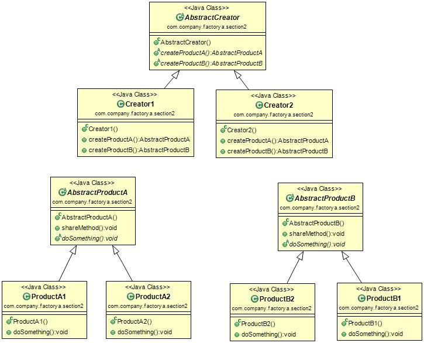

# 抽象工厂模式(Abstract Factory Pattern) 
定义：Provide an interface for creating families of related or dependent objects without specifying their concrete classes。为创建一组相关或相互依赖的对象提供一个接口，而且无需指定它们的具体类。  

抽象工厂模式的类图如下图：  

抽象工厂模式是工厂方法模式的升级版本，在有多个业务品种、业务分类时，通过抽象工厂模式产生需要的对象是一种非常好的解决方式。    

# 抽象工厂模式应用
### 1.抽象工厂模式的优点
 * 封装性，每个产品的实现类不是高层模块要关系的，要关心的是什么？是接口，是抽象，它不关心对象是如何创建出来，这由谁负责呢？工厂类，只要知道工厂类是谁，我就能创建出一个需要的对象，省时省力，优秀设计就应该如此。
 * 产品族内的约束为非公开状态。例如生产男女比例的问题上，猜想女娲娘娘肯定有自己的打算，不能让女盛男衰，否则女性的优点不就体现不出来了吗？那在抽象工厂模式，就应该有这样的一个约束：每生产1个女性，就同时生产出1.2个男性，这样的生产过程对调用工厂类的高层模块来说是透明的，它不需要知道这个约束，我就是要一个黄色女性产品就可以了，具体的产品族内的约束是在工厂内实现的。

### 2.抽象工厂模式的缺点 
抽象工厂模式的最大缺点就是产品族扩展非常困难，为什么这么说呢？我们以通用代码为例，如果要增加一个产品C，也就是说有产品家族由原来的2个，增加到3个，看看我们的程序有多大改动吧！抽象类AbstractCreator要增加一个方法createProductC()，然后，两个实现类都要修改，想想看，这在项目中的话，还这么让人活！严重违反了开闭原则，而且我们一直说明抽象类和接口是一个契约，改变契约，所有与契约有关系的代码都要修改，这段代码叫什么？叫“有毒代码”，——只要这段代码有关系，就可能产生侵害的危险！  

### 3.抽象工厂模式的使用场景
抽象工厂模式的使用场景定义非常简单：一个对象族（或是一组没有任何关系的对象）都有相同的约束，则可以使用抽象工厂模式，什么意思呢？例如一个文本编辑器和一个图片处理器，都是软件实体，但是*nix下的文本编辑器和WINDOWS下的文本编辑器虽然功能和界面都相同，但是代码实现是不同的，图片处理器也是类似情况，也就是具有了共同的约束条件：操作系统类型，于是我们可以使用抽象工厂模式，产生不同操作系统下的编辑器和图片处理器。  

### 4.抽象工厂模式的注意实现
在抽象工厂模式的缺点中，我们提到抽象工厂模式的产品族扩展比较困难，但是一定要清楚是产品族扩展困难，而不是产品等级，在该模式下，产品等级是非常容易扩展的，增加一个产品等级，只要增加一个工厂类负责新增加出来的产品生产任务即可，也就是说横向扩展容易，纵向扩展困难。以人类为例子， 产品等级中只要男、女两个性别，现实世界还有一种性别：双性人，即使男人也是女人（俗语就是阴阳人），那我们要扩展这个产品等级也是非常容易的，增加三个产品类，分别对应不同的肤色，然后再创建一个工厂类，专门负责不同肤色人的双性人的创建任务，完全通过扩展来实现的需求的变更，从这一点上看，抽象工厂模式是符合开闭原则的。  

# 最佳实践
一个模式在什么情况下才能够使用，是很多读者比较困惑的地方，抽象工厂模式是一个简单的模式，使用的场景非常多，大家在软件产品开发过程中，涉及到不同操作系统的时候，都可以考虑使用抽象工厂模式，例如一个应用，需要在三个不同平台上运行：Windows、Linux、Android（Google发布的智能终端操作系统）上运行，你会怎么设计？分别设计三套不同的应用？非也非也，通过抽象工厂模式屏蔽掉操作系统对应用的影响。三个不同操作系统上的软件功能、应用逻辑、UI都应该是非常类似，唯一不同的是调用不同的工厂方法，由不同的产品类去处理与操作系统交互的信息。  
